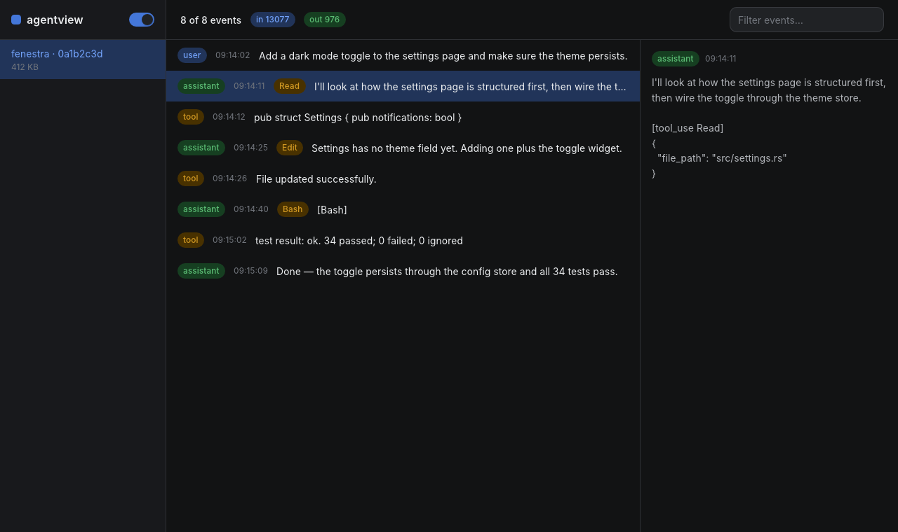

# agentview

Browse AI coding-agent session transcripts natively: sessions in the
sidebar, a virtualized timeline of turns and tool calls, a detail pane
with full payloads, token totals, filtering, light/dark.



Built with [fenestra](https://github.com/richer-richard/fenestra) — and
built *like* a fenestra app should be: the screenshot above is rendered
headlessly and deterministically from a fixture (`cargo run -- shot`),
the same loop an agent uses to verify its UI work.

## Run

```sh
cargo run --release
```

Reads Claude Code transcripts from `~/.claude/projects/*/*.jsonl`
(defensively — unknown line shapes are skipped). The 300 most recent
sessions are listed; selection parses on a background thread through
fenestra\'s command proxy.

## License

MIT or Apache-2.0, at your option.
